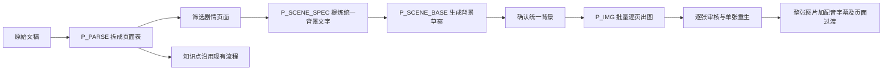

# 剧情页面批量出图：重新核对后的方案

2026-09-18。用户纠正：剧情页面的核心是批量生产剧情图片。本文修正此前实现方向；本文是流程核对与实施定义，当前网站尚未实现这里的自动生图链路。

## 交付单位

**一个剧情页面对应一张完整剧情图片；整组剧情页面批量得到多张图片。**

图片本身已经包含当前镜头的角色、背景、道具、表情、动作瞬间和明确要求的物理可视化。画面生成模型直接产出完整构图，平台的首要工作是保证页面内容、角色参考、场景参考和上下文正确进入每次生图请求，以及逐张保存、审核、重生和恢复。

“先稳定插画镜头与有限动效”确定的是视频表现形式，不能被解释成用户在外部制作所有图片、平台只接收上传。手动导入保留为替换图片的辅助入口。知识点仍沿用现有结构化板书、公式、电路和提示词。

## 小程序中的实际链路

1. **先拆页面。** `P_PARSE` 从原稿得到页面类型、景别/标题、单幅画面描述、台词和可选草图。原稿已有明确镜头编号时，保留一镜头一行；没有编号时按动作、情绪、场景、焦点变化拆页。1–3 句只是参考，不能强制破坏原稿镜头边界。保留台词与动作语义，不能只把配音文本发给模型而丢弃画面备注。
2. **从剧情页面汇总背景。** `P_SCENE_SPEC` 消费剧情镜头清单，提炼地点、光照、固定资产、允许的临时资产和空间约束。统一背景是后续出图的一致性条件，不是首次拆页的前提。
3. **生成并确认背景草案。** `P_SCENE_BASE` 消费场景规格，生成无角色的统一背景。用户可以调整、重生或上传替代图；确认后锁定版本。
4. **批量生产整张剧情画面。** 每个剧情页面独立调用生图接口，`n=1`。该页描述决定“这一刻画什么”，背景与 IP 图片决定“长什么样”。允许切景别和机位，同时保持同一空间、角色与道具体系。
5. **图片完成后再合成视频。** `P_ANIM` 明确：“动画页本身就是 AI 生成的图片，不需要任何元素级动画，只给一个切换效果即可。”原规则为 `[切换:淡入]`。缩放和平移可作为已有扩展选择，不能变成剧情页的生产中心或图片生成的前置任务。

## 一次剧情生图的完整输入

| 输入 | 作用 |
| --- | --- |
| `P_IMG` 主提示词 | 教学剧情画面的风格、构图、连续性、动作归属、物理合理性 |
| 固定 IP 规则及角色参考图 | 锁定方大招、金天练的外形和配色；描述里谁执行动作就画谁 |
| 已确认背景图及背景规格 | 锁定空间、光照、固定道具和允许变化范围 |
| 当前页草图（可选） | 约束取景与构图，不能照抄草图画质 |
| 前四个剧情页的文字摘要 | 延续动作、站位、道具状态、情绪和教学特效；实际代码没有自动传入前四张成品图 |
| 当前页景别与画面描述 | 指定当前页的一个瞬间、核心动作和必要现象 |
| 渲染边界片段 | 禁止无依据地添加家具、道具、角色和装饰，禁止多格拼贴 |

参考图必须实际传给图片接口。仅传角色姓名、素材 ID、背景文字或哈希，不能提供视觉一致性。小程序把确认背景、草图和 IP 图片合成最多四格的**输入参考板**，有参考图时调用 `/v1/images/edits`；没有参考图时调用 `/v1/images/generations`。参考板可以有多个区域，最终输出仍须是一张完整镜头，不能复制为多格成品。

源提示词提到“固定素材参考板”，但该包中 `buildSceneMaterialPromptBlock` 返回空字符串，不能把这项当成已落地的小程序功能。实际迁移优先对齐已经接通的背景、草图和 IP 参考。

`P_IMG` 允许当前描述明确需要的受力箭头、光路、电流方向、高亮和少量符号。网站此前一概禁止图片中出现物理标注，改变了原先的表达能力，而且并未为剧情补上相应合成层。纠偏应保留明确要求的教学可视化并审核准确性；配音字幕及长篇知识讲解继续独立排版，不能把剧情画面变成知识卡片。

## 网站需要改正的具体位置

| 当前实现 | 修正要求 |
| --- | --- |
| `videoMixedGeneration.ts` 在拆镜前强制确认并上传背景 | 拆页先独立完成；统一背景确认阻断的是剧情出图 |
| `videoStoryGeneration.ts` 主要返回画面描述与 motion | 剧情规划保留原稿镜头边界、景别、草图、动作和前文关系；图片生产成为独立后台任务 |
| `VideoStoryWorkspace.tsx` 以“导出任务单—导入插画—选动效”为主 | 改为“整理页面—准备统一背景与角色—批量生成剧情图片—逐张审核” |
| `buildStoryImageMessages` 只是消息构建器 | 真正接入登录配置中的 `gpt-image-2`，发送图片参考与完整提示词并保存图片结果 |
| 当前提示词严格每镜头 1–3 条台词 | 服从已有镜头编号；无明确编号时按节拍分组，同时保证原台词完整覆盖 |
| 当前平台契约统一排除物理箭头等 | 保留原文明确要求的教学可视化，并对结果进行审核 |

这些是尚需实施的缺口，不能把已复制 `P_IMG.md` 或已有图片模型设置称为“批量生图已完成”。

## 剧情页的交互与任务规则

- 页面主体为按原稿排序的剧情图片列表，展示页码、景别、画面说明、台词、草图和图片结果。
- 共享区域管理背景规格、背景草案/已确认背景，以及两名角色参考图。
- 主操作为“批量生成缺失/过期图片”；每页提供“生成本页 / 重新生成 / 上传替换 / 确认采用”。失败页可单独重试，已成功页默认跳过。
- 每张图独立记录排队、生成中、成功待审核、已采用、失败、过期状态。后台保存任务与结果，刷新或关闭页面不丢进度；一个失败页不清空其他成功页。
- 用户点击重生后保留旧图直到新图成功，避免小程序当前失败即清空 `src` 的行为。
- 缓存依据当前页内容、前文连续性、背景版本、角色/草图图片哈希、提示词版本/哈希及生图模型；改变输入后标记相关图片过期。
- 用户显式采用生成候选；批量生成不得静默覆盖审核后的图片或运行期间的新编辑。配音字幕、时长和简单过渡在图片完成后处理。

迁移保留小程序的业务流程与提示词组织，后台执行继续采用网站的持久化任务机制，不复制小程序页面内的 400ms 循环作为生产调度。

## 源码核对依据

参考根目录：`C:/Users/ZYB/WorkBuddy/小程序/小程序包/`。仅阅读源码，未执行小程序模块或读取其凭据配置。

| 文件位置 | 已核实的行为 |
| --- | --- |
| `utils/prompts-data.js` 的 `P_PARSE / P_SCENE_SPEC / P_SCENE_BASE / P_IMG / P_ANIM` | 五个阶段的职责和输出 |
| `pages/step3/step3.js:453` | 分镜行进入页面池，剧情页 `renderMode=bitmap` |
| `packages/shared-core/src/prompts.js:233` | 从动画镜头清单提炼背景 |
| `pages/step4/step4.js:614` | 生成背景规格、背景草案、确认背景 |
| `pages/step4/step4.js:1554` | 确认背景优先作为图片参考，并加入草图及 IP |
| `utils/animation.js:300` | 生图提示词拼接顺序 |
| `utils/animation.js:326` | 前四个剧情页的文字连续性摘要 |
| `utils/animation.js:468` | 图片参考合板 |
| `pages/step4/step4.js:2030` | 单页生图并保存结果和版本 |
| `pages/step4/step4.js:2103` | 对缺图或过期页逐页批量生产，统计成功/失败 |
| `utils/api.js:673` | 图片接口、参考上传和 `n=1` |

本次验收是源码链路与现有实现的对照核实，没有修改运行代码、没有生成付费图片，也不新增自动测试结论。
